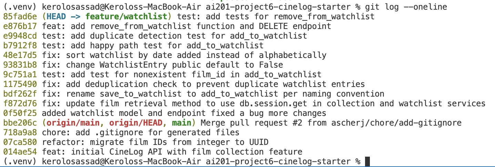

# PR Response Doc — CineLog Watchlist Feature

## AI Usage
<!-- Fill in at the end — how you used AI tools during this project -->

I used Claude throughout this project in several ways:

**Codebase orientation**: Before touching any review comments, I had Claude walk through `models.py`, `collection_service.py`, and `watchlist_service.py` with me to understand the existing naming conventions, the deduplication pattern in `add_to_collection()`, and how `WatchlistEntry`/`Film` related to each other, before applying the same patterns to the watchlist code.

**Code review, not code generation**: For the actual implementation (the rename, deduplication logic, `remove_from_watchlist()`, tests, and route changes), I wrote the code myself and used Claude to review it afterward, catching a few real bugs this way (e.g., an incorrect model reference in the deduplication check, a wrong field name in a sort query, an unused import). I did not ask Claude to write the deduplication or design-decision logic for me.

**Verification and debugging**: I used Claude to help design manual verification scripts (isolated, in-memory database checks) to confirm the deduplication logic and sort order actually worked, both before and after the rebase, and to help diagnose git issues along the way, including a rebase conflict in `models.py` and a stuck Vim commit-message editor.

**Stress-testing my Comment 4 reasoning**: This was the most significant use of AI in this project. My first draft of the Comment 4 response argued that `public` should default to `False` mainly because it was currently unenforced in the codebase, with a weaker, hedged position. I asked Claude to argue the counterposition as a careful reviewer would. It raised a real gap in my reasoning: `CollectionEntry` has no `public` field at all, meaning collections are effectively public today, so my argument that watchlists deserved *more* privacy than the app's existing, more sensitive feature (a completed viewing record) was internally inconsistent. This pushback led me to substantially rework my position: I kept the conclusion (default to `False`), but changed the actual justification to be about watchlists carrying less signal and more noise than collections (unfinished intent vs. a completed judgment), rather than the "it's currently unenforced" argument, which Claude also pointed out cuts both ways and isn't a strong justification on its own. I went through a similar, smaller stress-test on Comment 5's sort order argument before finalizing it.

**Git workflow support**: Claude helped me work through the mechanics of the `git rebase origin/main` conflict resolution (understanding an add/add conflict on `.gitignore`, and resolving `models.py`'s conflict between the maintainer's UUID refactor and my own `WatchlistEntry` changes), the interactive rebase (`git rebase -i`) for Milestone 4, and helped me correctly identify that two commits in my branch's history (`0f50f25`, `f872d76`) were authored by the maintainer persona and shouldn't be reworded or dropped during that process.

Where AI did not help: the final wording and specific reasoning in Comments 4 and 5 are my own; I used Claude to pressure-test my draft arguments, not to generate them from scratch.

## Comment 1 — Rename
**What I did:** Renamed save_to_watchlist() to add_to_watchlist() in services/watchlist_service.py to follow the project's verb_to_noun convention (matching add_to_collection()), and updated its docstring wording from "Save a film..." to "Add a film..." for consistency. Updated the import statement and the function call in routes/watchlist/watchlist.py to also use the new name.

**How I verified:** Ran `grep -rn "save_to_watchlist" .` project-wide — no remaining references in source files (only stale __pycache__ bytecode, which is gitignored and regenerates automatically).

## Comment 2 — Deduplication
**What I did:** Added a deduplication check to add_to_watchlist() in services/watchlist_service.py, following the same pattern as add_to_collection() in collection_service.py: after confirming the film exists, the function queries WatchlistEntry for an existing entry matching user_id and film_id. If found, it raises a new AlreadyInWatchlistError instead of creating a duplicate entry.

**How I verified:** Compared the implementation directly against `add_to_collection()`'s three-step pattern (check film exists → check for duplicate → create entry) to confirm the structure matched. Ran the full test suite (`pytest tests/ -v`) to confirm no existing tests broke. Initially verified the behavior manually by calling `add_to_watchlist()` twice with the same `user_id`/`film_id` in a Python shell, and later added `test_add_to_watchlist_duplicate_raises` (see Stretch — Second Test) as permanent automated coverage for this exact behavior.

## Comment 3 — Missing test
**What I did:** Created tests/test_watchlist.py with test_add_to_watchlist_nonexistent_film_raises, modeled directly on test_add_to_collection_nonexistent_film_raises from test_collection.py — same fixture structure (app, sample_user), same fake-UUID pattern, same pytest.raises assertion, adapted for add_to_watchlist() and FilmNotFoundError.

**How I verified:** Ran `pytest tests/test_watchlist.py -v` (passed) and then the full suite `pytest tests/ -v` (all 5 tests passed, confirming no regressions in the existing collection tests).

## Comment 4 — Default visibility
**My position:** Keep the `public` field on `WatchlistEntry`, but change its default from `True` to `False`.

**Reasoning:** A watchlist entry represents intent, a film the user wants to watch but hasn't engaged with yet. A collection entry represents a completed experience: the user watched the film and, often, rated it. That difference matters for a default visibility decision. Collections carry real signal about a user's taste, since watching something takes time and effort, so the list is naturally curated. Watchlists are likely to be noisier and less deliberate, since people add films impulsively (a trailer, a friend's recommendation) without much commitment, and often never get around to them or change their minds. There is less obvious value in exposing that kind of unfinished, low-signal list by default, and users may feel a subtle pressure to justify or complete a watchlist that is visible to others.

It's also important to note what this change actually does today: nothing in the current codebase reads or enforces `public` at all. `get_watchlist()` returns every entry for a user regardless of the flag, and there is no endpoint that lets one user view another user's watchlist in the first place. So changing the default from `True` to `False` has no effect on any currently observable behavior; the API returns the same data either way. What it does change is the stored value new entries will carry once visibility enforcement is actually built, whether that's a future endpoint, an admin view, or a UI toggle. Setting the safer default now means existing rows will already reflect the intended behavior when that logic ships, instead of requiring a data migration to fix a default that was never deliberately chosen. Removing the `public` field entirely was also considered, but it doesn't resolve the underlying question. It would either force every entry to be treated as public with no way to change that later, or require the same default decision to be hardcoded elsewhere, while also losing the ability to add visibility controls later without a schema change. Keeping the field and defaulting it to `False` preserves that flexibility while addressing the concern directly.

**Tradeoff acknowledged:** Defaulting to `public=True` would better serve CineLog's identity as a "community film tracking app" (per the README), since public watchlists could drive discovery and social engagement without requiring users to opt in. Collections also currently have no `public` field at all, meaning they are effectively public by default today, and one could argue watchlists should follow the same pattern for consistency. The tradeoff of a private default is that it requires deliberate action from users to make their lists social, which could mean less visible activity in a community-oriented product, at least until a real visibility feature exists and users start opting in. Given that watchlist entries carry less signal and more noise than collection entries, and that the cost of defaulting private (a quieter feature, easily revisited later) is lower than the cost of defaulting public (real user data exposed before anyone deliberately decided that was appropriate), private still seems like the safer and more intentional default here.

## Comment 5 — Sort order
**My position:** Change the watchlist's default sort order from alphabetical to date-added, most recent first, matching the maintainer's preference.

**Reasoning:** A watchlist represents intent the user hasn't acted on yet, so recency is a more natural way to browse it than title. Users are more likely to remember roughly when they added something than to remember its exact title, especially since the entire point of a watchlist is to hold on to films before the user has fully engaged with them. This also creates consistency with `get_collection()`, which already sorts newest-first; a user moving between their collection and watchlist gets a familiar ordering pattern rather than two features behaving differently for no clear reason. If watchlists are eventually made visible to other users (see Comment 4), a date-added order would also better support a sense of current activity, showing what people are actively adding, closer to how a community feed behaves, whereas alphabetical would make a shared list read more like a static catalog. This is a secondary consideration since the feature isn't public yet, but it's a reasonable point in favor of date-added holding up well if visibility is added later.

I also considered two other options grounded in the existing schema: sorting by `Film.average_rating` to surface the highest-rated unwatched films first, and sorting by date-added ascending (oldest first) to nudge users toward finally watching things they've been putting off. Both are reasonable, but I still preferred date-added descending for its consistency with the collection sort and its direct match to the reviewer's stated reasoning.

**Engagement with reviewer's point:** I agree with the reviewer's reasoning that most users want to see what they added recently, and I think the consistency with the existing collection sort makes this an easy case. The main argument for keeping alphabetical order is that it makes it easy to quickly check whether a specific film is already on the watchlist. That's a real need, but it's a lookup problem, not a browsing problem, and it would be better solved by adding search or filtering by title later rather than by choosing the default sort order around it. Alphabetical order does have a real advantage worth naming: because a film's position depends on its title rather than when it was added, older and newer entries end up interleaved throughout the list instead of newer ones clustering at the top. That can make browsing the watchlist feel more varied, since users aren't implicitly steered toward only their most recently added films. I still lean toward date-added as the default, since recency better matches how users think about an unfinished list, but this tradeoff is worth being explicit about rather than treating alphabetical as having no real upside.

## Comment 6 — Rebase
**What conflicted:** Two files conflicted when running `git rebase origin/main`. First, `.gitignore`: both branches had independently added a `.gitignore` file, with `main`'s version including an extra `.pytest_cache/` entry that mine didn't have. Second, `models.py`: `main` had already completed the integer-to-UUID refactor (`Film.id` changed from `db.Integer` to `db.String(36)`, and `CollectionEntry.film_id` was updated to match), but `main` had no `WatchlistEntry` class at all, since the watchlist feature only ever existed on this branch. My commit adding the `public` default change conflicted because it was reapplying the entire `WatchlistEntry` class, which still referenced `film_id` as `db.Integer` from before the refactor.

**How I resolved it:** For `.gitignore`, I kept both rule sets, merging in the `.pytest_cache/` line from `main` alongside my existing rules. For `models.py`, I kept `main`'s updated `User`, `Film`, and `CollectionEntry` classes as-is, and re-added my `WatchlistEntry` class with `film_id` changed from `db.Integer` to `db.String(36)` to match the new UUID scheme on `Film.id`.

**How I verified no conflict remains:** After resolving both files and running `git add` followed by `git rebase --continue` for each, the rebase completed with no further conflicts and reported "Successfully rebased and updated refs/heads/feature/watchlist." I confirmed no leftover conflict markers remained with `grep -n "<<<<<<<\|=======\|>>>>>>>" models.py services/watchlist_service.py`, which returned nothing. I ran the full test suite (`pytest tests/ -v`), and all 5 tests still passed. I also manually re-verified the deduplication logic from Comment 2 against real UUID-based film IDs (rather than the old integer IDs), confirming `add_to_watchlist()` still correctly raises `AlreadyInWatchlistError` on a duplicate add after the ID type change. `git log --oneline` confirms a linear history with no merge commits, with my commits replayed cleanly on top of `main`'s existing history, including the UUID refactor commit (`fix: update film retrieval method to use db.session.get in collection and watchlist services`).

## Stretch — Add remove_from_watchlist()
**What I did:** Implemented `remove_from_watchlist(user_id, film_id)` in `services/watchlist_service.py`, following the same pattern as `remove_from_collection()` in `collection_service.py`: query for an existing `WatchlistEntry` matching `user_id` and `film_id`, and if none exists, raise a new `NotInWatchlistError` rather than silently succeeding or raising a generic database error. If found, delete the entry, commit, and return `True`. Also added a matching `DELETE /watchlist/<user_id>/remove` endpoint in `routes/watchlist/watchlist.py`, modeled directly on `collection.py`'s `remove_film` route, including the same request body validation and try/except handling to return a 404 with a clear error message when `NotInWatchlistError` is raised.

**How I verified:** Wrote two tests in `tests/test_watchlist.py`: `test_remove_from_watchlist_removes_entry`, which adds a film, removes it, and confirms both the return value (`True`) and that the entry no longer exists in the database, and `test_remove_from_watchlist_not_in_watchlist_raises`, which confirms `NotInWatchlistError` is correctly raised when attempting to remove a film that was never added. Ran the full test suite (`pytest tests/ -v`); all 9 tests pass.

## Stretch — Second Test
**What I did:** Added `test_add_to_watchlist_duplicate_raises`, covering the duplicate-detection behavior added in Comment 2, which previously had no automated test coverage (it had only been verified manually). I chose this edge case because dedup logic is easy to silently break during future refactors, and having a permanent regression test protects that behavior going forward. I also added `test_add_to_watchlist_creates_entry` as a happy-path test for completeness, matching `test_collection.py`'s equivalent coverage for `add_to_collection()`.

**How I verified:** Ran `pytest tests/test_watchlist.py -v` and the full suite `pytest tests/ -v`; all tests pass, including both new tests alongside the existing coverage.

## PR Description
<!-- Written at the end — feature overview, design decisions, manual testing steps -->
### What this PR does

This PR addresses the maintainer's review of the watchlist feature (renaming, deduplication, a missing test, default visibility, sort order, and a rebase onto the UUID-refactored `main`), and extends it with a new `remove_from_watchlist()` function and corresponding `DELETE` endpoint. The watchlist lets users save films they want to watch later, separate from their collection of films they've already watched.

### Design decisions

- **Default visibility**: New watchlist entries default to `public=False` (changed from `True`). Watchlists represent unfinished intent rather than a completed viewing history, and carry less signal/more noise than collections, so a private default is the safer, more intentional choice until real visibility controls are built.
- **Sort order**: `get_watchlist()` now sorts by date added, most recent first (changed from alphabetical), matching the maintainer's preference and staying consistent with `get_collection()`'s existing sort behavior.

### Manual testing

1. Start the app: `python app.py`
2. Create a test user and film using the Flask shell (no seed script exists in this repo):
```bash
   python3 -c "
   from app import create_app, db
   from models import User, Film

   app = create_app()
   with app.app_context():
       user = User(username='testuser', email='test@example.com')
       film = Film(title='Test Film', year=2020, genre='Drama')
       db.session.add_all([user, film])
       db.session.commit()
       print('user_id:', user.id)
       print('film_id:', film.id)
   "
```
3. Add the film to the watchlist: `POST /watchlist/<user_id>/add` with body `{"film_id": "<film_id>"}` — should return `201` with the new entry.
4. Attempt to add the same film again — this currently returns an unhandled `500` rather than a clean error response; see Known Issues below.
5. Remove the film: `DELETE /watchlist/<user_id>/remove` with body `{"film_id": "<film_id>"}` — should return `200`.
6. Attempt to remove it again — should return `404` with a clear error message.

### Known issues (pre-existing, out of scope for this PR)

- `GET /watchlist/<user_id>` currently raises an `AttributeError`, since `WatchlistEntry` is missing a `.film` relationship backref that `CollectionEntry` has. This predates this PR and wasn't introduced by any of the six review comments.
- `add_film` (`POST /watchlist/<user_id>/add`) doesn't currently catch `FilmNotFoundError` or `AlreadyInWatchlistError`, so invalid requests return an unhandled `500` instead of a clean `404`/`409`, unlike the equivalent `collection.py` route.

## Commit History
